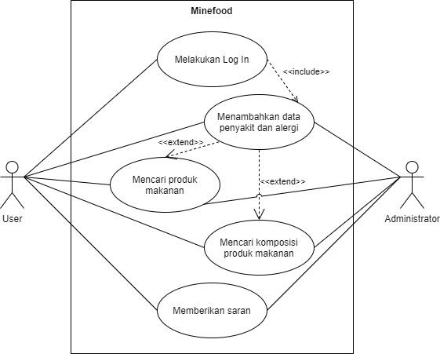
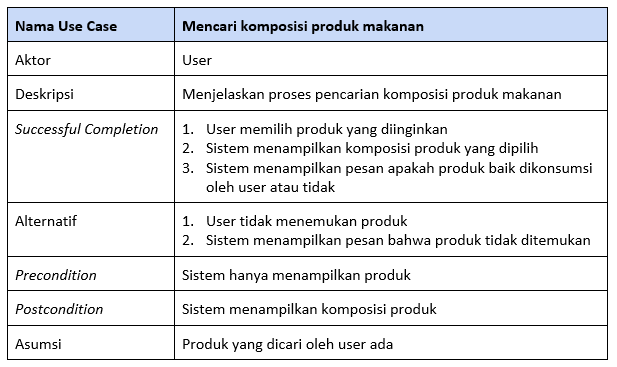
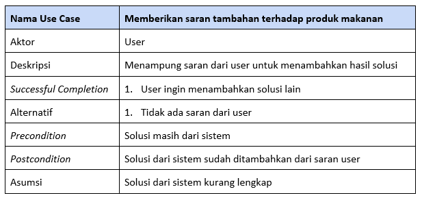
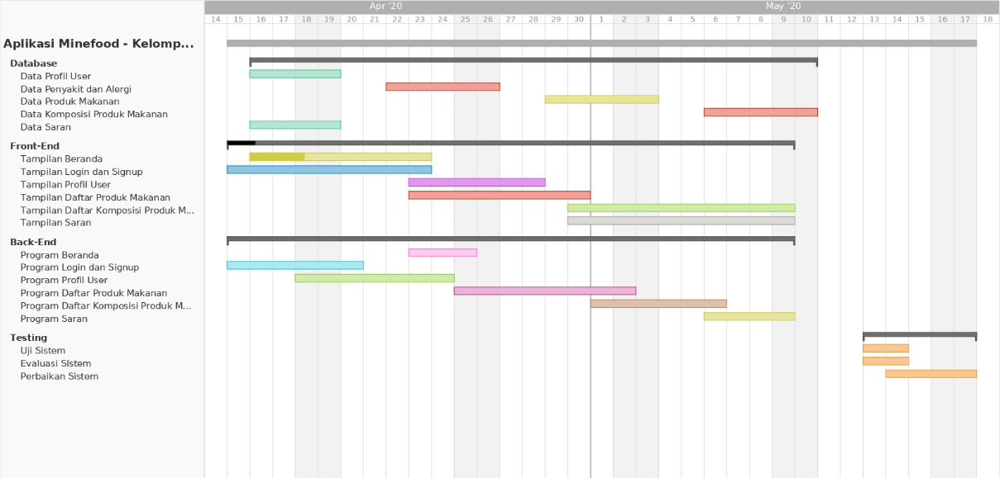

## Minefood

**Aplikasi Panduan Konsumsi Produk Makanan**

**Mata Kuliah :** Rekayasa Perangkat Lunak

**Paralel Praktikum :** 2

**Asisten Praktikum :** Feby Tri Saputra

**Kelompok 10 :**
1. Bintang Fikriguska (G64180024)
2. Putri Melanita Londong Bua (G64180053)
3. Ananda Alfarishi Anwar (G64180097)

---

### Latar Belakang

Perkembangan teknologi informasi di zaman sekarang ini, banyak masyarakat yang sudah menggunakan teknologi canggih seperti smartphone dalam aktivitas sehari-hari. Smartphone juga dapat digunakan oleh berbagai kalangan karena cara menggunakannya sangat mudah. Bahkan smartphone juga menjadi media yang efektif untuk penyebarluasan informasi.

Walaupun teknologi canggih selalu berkembang, ada beberapa masyarakat melupakan kesehatannya sendiri akibat berlebihan menggunakan teknologi tersebut. Seperti tidak menjaga pola makan, selalu memakan produk kemasan yang cepat saji, dan lain-lain. Akibatnya masyarakat sering tiba-tiba terkena penyakit pencernaan karena tidak tahu asal komposisi produk makanannya. Oleh karena itu, perlu adanya aplikasi panduan konsumsi pada produk makanan kemasan. Sehingga masyarakat tidak perlu khawatir terhadap produk makanan kemasan yang ingin dikonsumsinya.

### Tujuan

Tujuan dari pengembangan aplikasi ini untuk masyarakat adalah pengembang dapat memberi tahu informasi seputar produk makanan kemasan yang ingin dikonsumsi masyarakat agar terhindar dari alergi atau penyakit.

### Ruang Lingkup

Ruang lingkup proyek Pengembangan Aplikasi Panduan Konsumsi Produk Makanan “Minefood” yaitu:
1. **Program untuk Data Produk Makanan**\
Program ini berfungsi menyimpan data produk makanan beserta komposisi produknya.

2. **Aplikasi untuk Masyarakat**\
Fitur-fitur yang ada pada aplikasi ini yaitu:
    - Data riwayat penyakit: untuk memasukkan nama penyakit dan alergi pengguna sebagai acuan panduan konsumsi produk makanan kemasan.
    - Data produk makanan: untuk mengetahui produk makanan yang boleh dikonsumsi dan tidak boleh dikonsumsi.
    - Saran: untuk memberi rekomendasi terhadap produk makanan kemasan yang cocok atau tidak bagi pengguna lain berdasarkan data riwayat penyakitnya.

### Deskripsi Perangkat Lunak

Fitur pertama yang digunakan saat memulai aplikasi ini adalah memasukkan data riwayat penyakit pengguna yang selanjutnya akan diteruskan ke fitur yang lain. Fitur selanjutnya terdapat memasukkan nama produk makanan untuk mencari data komposisi produk makanannya dan dicocokan dengan riwayat penyakit pengguna. Lalu, aplikasi menyatakan apakah produk makanan tersebut aman dikonsumsi oleh pengguna atau tidak. Selain itu, terdapat fitur ulasan dari pengguna lain terhadap produk makanan tersebut, apakah produk makanan tersebut juga berpengaruh pada penyakit lain atau tidak. Aplikasi ini tersedia juga fitur jual beli produk makanan sehat yang dibuat oleh industri rumahan sehingga pengguna tak perlu khawatir mengonsumsi terhadap produk makanannya. Jual beli produk makanan tersebut dapat dilakukan secara online dengan pembayaran online dan dikirim ke alamat yang dituju.

### Analisis User (User Profile)

### User Story

1. Fitur Daftar Penyakit dan Alergi

**Peran**|**Fitur**|**Nilai Bisnis**
---------|---------|----------------
User|Saya ingin menambahkan nama penyakit pada profil saya|Saya bisa mengetahui daftar larangan konsumsi untuk saya
User|Saya ingin mencari nama penyakit pada kolom pencarian|Saya bisa melihat daftar larangan konsumsi berdasarkan penyakit

2. Fitur Daftar Produk Makanan

**Peran**|**Fitur**|**Nilai Bisnis**
---------|---------|----------------
User|Saya ingin melihat nama produk makanan|Saya bisa mengetahui daftar komposisi produk makanan tersebut
User|Saya ingin mengetahui produk makanan tersebut dilarang dikonsumsi atau tidak|Saya bisa mencegah konsumsi produk makanan tersebut

3. Fitur Daftar Komposisi Produk Makanan

**Peran**|**Fitur**|**Nilai Bisnis**
---------|---------|----------------
User|Saya ingin melihat nama komposisi produk makanan|Saya bisa mengetahui apakah produk makanan tersebut aman atau tidak
User|Saya ingin mengetahui komposisi tersebut dilarang dikonsumsi atau tidak|Saya bisa mencegah konsumsi produk makanan tersebut

4. Fitur Saran

**Peran**|**Fitur**|**Nilai Bisnis**
---------|---------|----------------
User|Saya ingin menambahkan saran nama penyakit dan larangan konsumsinya|Saran saya bisa berguna untuk user lain
User|Saya ingin mencari saran larangan konsumsi berdasarkan nama penyakit|Saya bisa melihat daftar larangan konsumsi yang tidak tercantum

### Use Case Diagram

### Use Case Description

1. Fitur Daftar Penyakit dan Alergi

**Nama Use Case**|**Memasukkan data penyakit dan alergi**
-----------------|---------------------------------------
Aktor|User
Deskripsi|Menjelaskan proses input data penyakit dan alergi
*Successful Completion*|<ol><li>User memasukkan data penyakit dan alergi</li><li>Sistem mencari larangan konsumsi berdasarkan penyakit dan alergi User</li><li>Sistem mengirimkan daftar larangan konsumsi kepada User</li></ol>
Alternatif|<ol><li>User memasukkan data penyakit dan alergi</li><li>Sistem tidak menemukan larangan konsumsi karena penyakit dan alergi User belum teridentifikasi</li><li>Sistem mengirimkan pesan saran larangan konsumsi terhadap penyakit dan alergi User</li></ol>
*Precondition*|User melakukan input data penyakit dan alergi untuk mencari larangan konsumsi bagi User
*Postcondition*|Informasi larangan konsumsi bagi User untuk dilanjutkan ke proses pencarian produk makanan yang cocok bagi User
Asumsi|User kesulitan mencari larangan konsumsi berdasarkan penyakit dan alerginya yang belum teridentifikasi

2. Fitur Daftar Produk Makanan

**Nama Use Case**|**Mencari produk makanan**
-----------------|---------------------------------------
Aktor|User
Deskripsi|Menjelaskan proses pencarian produk makanan
*Successful Completion*|<ol><li>User memasukkan kata kunci nama produk makanan</li><li>Sistem mencari nama produk makanan apakah produk tersebut masuk ke dalam data Minefood</li><li>Jika masuk, sistem akan mencari komposisi produk makanan</li></ol>
Alternatif|<ol><li>User memasukkan kata kunci nama produk makanan</li><li>Sistem mencari nama produk makanan apakah produk tersebut masuk ke dalam data Minefood</li><li>Jika tidak masuk, sistem mengarahkan User untuk mendaftar nama produk makanan beserta komposisinya</li></ol>
*Precondition*|User memasukkan nama produk di kolom pencarian
*Postcondition*|Sistem menampilkan hasil pencarian produk
Asumsi|User ingin mencari produk

3. Fitur Daftar Komposisi Produk Makanan

4. Fitur Saran

### Activity Diagram

### Gantt Chart

### Entity Relationship Diagram

### Hasil Implementasi Perangkat Lunak

