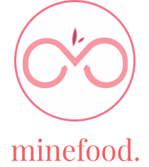
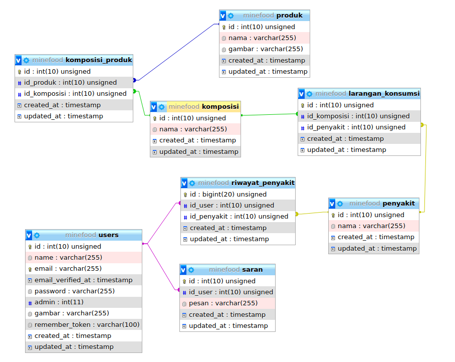

## Minefood

**Aplikasi Panduan Konsumsi Produk Makanan**

**Mata Kuliah :** Rekayasa Perangkat Lunak

**Paralel Praktikum :** 2

**Asisten Praktikum :** Feby Tri Saputra

**Kelompok 10 :**
1. Bintang Fikriguska (G64180024)
2. Putri Melanita Londong Bua (G64180053)
3. Ananda Alfarishi Anwar (G64180097)

---

### Latar Belakang

Perkembangan teknologi informasi di zaman sekarang ini, banyak masyarakat yang sudah menggunakan teknologi canggih seperti smartphone dalam aktivitas sehari-hari. Smartphone juga dapat digunakan oleh berbagai kalangan karena cara menggunakannya sangat mudah. Bahkan smartphone juga menjadi media yang efektif untuk penyebarluasan informasi.

Walaupun teknologi canggih selalu berkembang, ada beberapa masyarakat melupakan kesehatannya sendiri akibat berlebihan menggunakan teknologi tersebut. Seperti tidak menjaga pola makan, selalu memakan produk kemasan yang cepat saji, dan lain-lain. Akibatnya masyarakat sering tiba-tiba terkena penyakit pencernaan karena tidak tahu asal komposisi produk makanannya. Oleh karena itu, perlu adanya aplikasi panduan konsumsi pada produk makanan kemasan. Sehingga masyarakat tidak perlu khawatir terhadap produk makanan kemasan yang ingin dikonsumsinya.

### Tujuan

Tujuan dari pengembangan aplikasi ini untuk masyarakat adalah pengembang dapat memberi tahu informasi seputar produk makanan kemasan yang ingin dikonsumsi masyarakat agar terhindar dari alergi atau penyakit.

### Ruang Lingkup

Ruang lingkup proyek Pengembangan Aplikasi Panduan Konsumsi Produk Makanan “Minefood” yaitu:
1. **Program untuk Data Produk Makanan**\
Program ini berfungsi menyimpan data produk makanan beserta komposisi produknya.

2. **Aplikasi untuk Masyarakat**\
Fitur-fitur yang ada pada aplikasi ini yaitu:
    - Data riwayat penyakit: untuk memasukkan nama penyakit dan alergi pengguna sebagai acuan panduan konsumsi produk makanan kemasan.
    - Data produk makanan: untuk mengetahui produk makanan yang boleh dikonsumsi dan tidak boleh dikonsumsi.
    - Saran: untuk memberi rekomendasi terhadap produk makanan kemasan yang cocok atau tidak bagi pengguna lain berdasarkan data riwayat penyakitnya.

### Deskripsi Perangkat Lunak

Fitur pertama yang digunakan saat memulai aplikasi ini adalah memasukkan data riwayat penyakit pengguna yang selanjutnya akan diteruskan ke fitur yang lain. Fitur selanjutnya terdapat memasukkan nama produk makanan untuk mencari data komposisi produk makanannya dan dicocokan dengan riwayat penyakit pengguna. Lalu, aplikasi menyatakan apakah produk makanan tersebut aman dikonsumsi oleh pengguna atau tidak. Selain itu, terdapat fitur ulasan dari pengguna lain terhadap produk makanan tersebut, apakah produk makanan tersebut juga berpengaruh pada penyakit lain atau tidak. Aplikasi ini tersedia juga fitur jual beli produk makanan sehat yang dibuat oleh industri rumahan sehingga pengguna tak perlu khawatir mengonsumsi terhadap produk makanannya. Jual beli produk makanan tersebut dapat dilakukan secara online dengan pembayaran online dan dikirim ke alamat yang dituju.

### Analisis User (User Profile)

### User Story

### Use Case Diagram

### Use Case Description

### Activity Diagram

### Gantt Chart

### Entity Relationship Diagram

### Hasil Implementasi Perangkat Lunak

## About Laravel

Laravel is a web application framework with expressive, elegant syntax. We believe development must be an enjoyable and creative experience to be truly fulfilling. Laravel takes the pain out of development by easing common tasks used in many web projects, such as:

- [Simple, fast routing engine](https://laravel.com/docs/routing).
- [Powerful dependency injection container](https://laravel.com/docs/container).
- Multiple back-ends for [session](https://laravel.com/docs/session) and [cache](https://laravel.com/docs/cache) storage.
- Expressive, intuitive [database ORM](https://laravel.com/docs/eloquent).
- Database agnostic [schema migrations](https://laravel.com/docs/migrations).
- [Robust background job processing](https://laravel.com/docs/queues).
- [Real-time event broadcasting](https://laravel.com/docs/broadcasting).

Laravel is accessible, powerful, and provides tools required for large, robust applications.

## Learning Laravel

Laravel has the most extensive and thorough [documentation](https://laravel.com/docs) and video tutorial library of all modern web application frameworks, making it a breeze to get started with the framework.

If you don't feel like reading, [Laracasts](https://laracasts.com) can help. Laracasts contains over 1500 video tutorials on a range of topics including Laravel, modern PHP, unit testing, and JavaScript. Boost your skills by digging into our comprehensive video library.

## Laravel Sponsors

We would like to extend our thanks to the following sponsors for funding Laravel development. If you are interested in becoming a sponsor, please visit the Laravel [Patreon page](https://patreon.com/taylorotwell).

- **[Vehikl](https://vehikl.com/)**
- **[Tighten Co.](https://tighten.co)**
- **[Kirschbaum Development Group](https://kirschbaumdevelopment.com)**
- **[64 Robots](https://64robots.com)**
- **[Cubet Techno Labs](https://cubettech.com)**
- **[Cyber-Duck](https://cyber-duck.co.uk)**
- **[British Software Development](https://www.britishsoftware.co)**
- **[Webdock, Fast VPS Hosting](https://www.webdock.io/en)**
- **[DevSquad](https://devsquad.com)**
- [UserInsights](https://userinsights.com)
- [Fragrantica](https://www.fragrantica.com)
- [SOFTonSOFA](https://softonsofa.com/)
- [User10](https://user10.com)
- [Soumettre.fr](https://soumettre.fr/)
- [CodeBrisk](https://codebrisk.com)
- [1Forge](https://1forge.com)
- [TECPRESSO](https://tecpresso.co.jp/)
- [Runtime Converter](http://runtimeconverter.com/)
- [WebL'Agence](https://weblagence.com/)
- [Invoice Ninja](https://www.invoiceninja.com)
- [iMi digital](https://www.imi-digital.de/)
- [Earthlink](https://www.earthlink.ro/)
- [Steadfast Collective](https://steadfastcollective.com/)
- [We Are The Robots Inc.](https://watr.mx/)
- [Understand.io](https://www.understand.io/)
- [Abdel Elrafa](https://abdelelrafa.com)
- [Hyper Host](https://hyper.host)
- [Appoly](https://www.appoly.co.uk)
- [OP.GG](https://op.gg)
- [云软科技](http://www.yunruan.ltd/)

## Contributing

Thank you for considering contributing to the Laravel framework! The contribution guide can be found in the [Laravel documentation](https://laravel.com/docs/contributions).

## Code of Conduct

In order to ensure that the Laravel community is welcoming to all, please review and abide by the [Code of Conduct](https://laravel.com/docs/contributions#code-of-conduct).

## Security Vulnerabilities

If you discover a security vulnerability within Laravel, please send an e-mail to Taylor Otwell via [taylor@laravel.com](mailto:taylor@laravel.com). All security vulnerabilities will be promptly addressed.

## License

The Laravel framework is open-sourced software licensed under the [MIT license](https://opensource.org/licenses/MIT).
