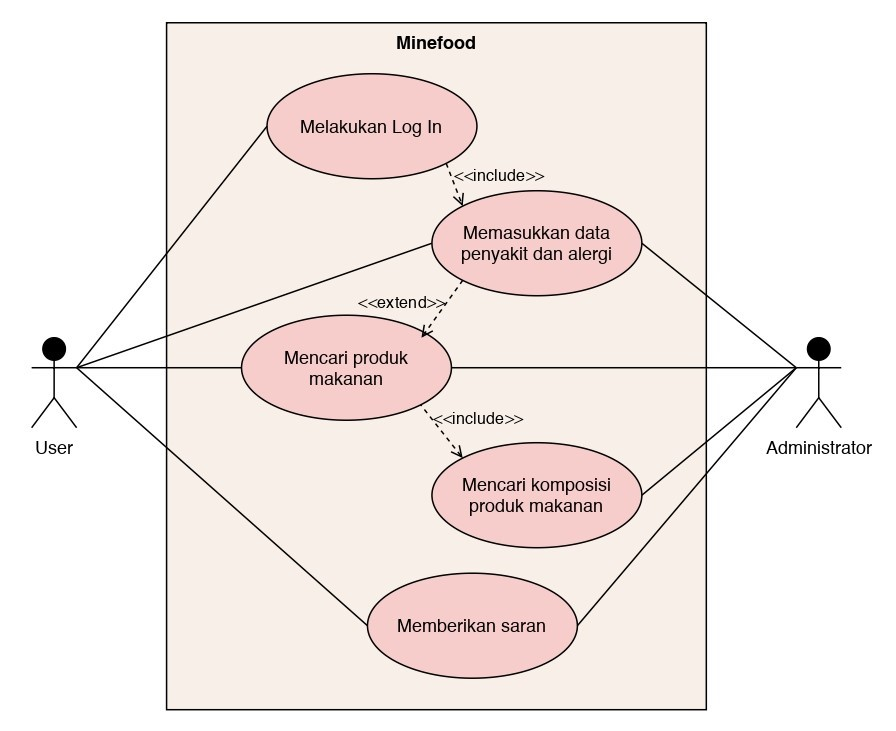

# Minefood.

**Aplikasi Panduan Konsumsi Produk Makanan**

**Mata Kuliah :** Rekayasa Perangkat Lunak

**Paralel Praktikum :** 2

**Asisten Praktikum :** Feby Tri Saputra

**Kelompok 10 :**
1. Bintang Fikriguska (G64180024)
2. Putri Melanita Londong Bua (G64180053)
3. Ananda Alfarishi Anwar (G64180097)

---

## Latar Belakang

Pada zaman perkembangan teknologi informasi ini, banyak masyarakat yang sudah menggunakan teknologi canggih seperti *smartphone* dalam aktivitas sehari-hari. *Smartphone* dapat digunakan oleh berbagai kalangan, karena cara menggunakannya sangat mudah. Bahkan, *smartphone* juga menjadi media yang efektif untuk penyebarluasan informasi.

Walaupun teknologi canggih selalu berkembang, ada beberapa masyarakat melupakan untuk memperhatikan kesehatannya sendiri akibat penggunaan berlebihan pada teknologi tersebut. Seperti tidak menjaga pola makan, selalu mengkonsumsi produk makanan yang cepat saji, dan lain-lain. Akibatnya, masyarakat sering tiba-tiba terkena penyakit pencernaan atau yang lainnya karena tidak tahu asal komposisi produk makanannya. Oleh karena itu, perlu adanya aplikasi panduan konsumsi pada produk makanan, sehingga masyarakat tidak perlu khawatir terhadap produk makanan yang ingin dikonsumsinya.

## Tujuan

Tujuan dari pengembangan aplikasi ini untuk masyarakat adalah untuk memberi tahu informasi seputar produk makanan yang ingin dikonsumsi masyarakat agar terhindar dari penyakit atau alergi.

## Ruang Lingkup

Ruang lingkup proyek Pengembangan Aplikasi Panduan Konsumsi Produk Makanan “Minefood” yaitu:
1. **Program untuk Data Penyakit**\
Program ini berfungsi untuk menyimpan data penyakit keseluruhannya.

2. **Program untuk Data Produk Makanan**\
Program ini berfungsi untuk menyimpan data produk makanan beserta komposisi produknya.

3. **Aplikasi untuk Masyarakat**\
Fitur-fitur yang ada pada aplikasi ini yaitu:
    - Daftar penyakit: untuk memasukkan nama penyakit dan alergi user sebagai acuan panduan konsumsi produk makanan.
    - Daftar produk makanan: untuk mengetahui produk makanan yang boleh dikonsumsi dan tidak boleh dikonsumsi.
    - Daftar komposisi produk makanan: untuk mengetahui kadar komposisi suatu produk makanan.
    - Saran: untuk memberi rekomendasi terhadap produk makanan yang cocok atau tidak bagi pengguna lain berdasarkan riwayat penyakitnya.

## Deskripsi Perangkat Lunak

Fitur pertama yang digunakan saat memulai aplikasi ini adalah dapat memasukkan data riwayat penyakit user. Fitur selanjutnya, user dapat memasukkan nama produk makanan untuk mencari data komposisi produk makanannya dan dicocokan dengan riwayat penyakit user. Jika user hanya ingin melihat data produk makanan berdasarkan nama penyakit yang ia cari, maka user dapat memasukkan nama penyakit pada kolom pencarian. Setelah itu, user dapat melihat semua daftar produk makanan berdarkan nama penyakit tersebut. Lalu, sistem akan menyatakan apakah produk makanan tersebut aman dikonsumsi oleh user atau tidak. Selain itu, terdapat fitur saran dari user lain terhadap produk makanan tersebut, apakah produk makanan tersebut juga berpengaruh pada penyakit lain atau tidak.

## Analisis User (User Profile)

1. **User** : memasukkan dan mencari nama penyakit, mencari produk makanan yang dilarang dikonsumsi, mencari komposisi produk makanan, dan memberikan saran jika menemukan penyakit dan larangan konsumsinya.
2. **Administrator** : mencocokkan data penyakit dan alergi dengan komposisi produk makanan, serta memilah saran dari user untuk dijadikan data baru.

## User Story

1. **Fitur Daftar Penyakit**

**Peran**|**Fitur**|**Nilai Bisnis**
---------|---------|----------------
User|Saya ingin memasukkan nama penyakit pada profil saya|Saya bisa mengetahui daftar larangan konsumsi untuk saya
User|Saya ingin mencari nama penyakit pada kolom pencarian|Saya bisa melihat daftar larangan konsumsi berdasarkan penyakit

2. **Fitur Daftar Produk Makanan**

**Peran**|**Fitur**|**Nilai Bisnis**
---------|---------|----------------
User|Saya ingin melihat nama produk makanan|Saya bisa mengetahui daftar komposisi produk makanan tersebut
User|Saya ingin mengetahui produk makanan tersebut dilarang dikonsumsi atau tidak|Saya bisa mencegah konsumsi produk makanan tersebut

3. **Fitur Daftar Komposisi Produk Makanan**

**Peran**|**Fitur**|**Nilai Bisnis**
---------|---------|----------------
User|Saya ingin melihat nama komposisi produk makanan|Saya bisa mengetahui kadar komposisi produk makanan tersebut
User|Saya ingin mengetahui komposisi tersebut dilarang dikonsumsi atau tidak|Saya bisa mencegah konsumsi produk makanan tersebut

4. **Fitur Saran**

**Peran**|**Fitur**|**Nilai Bisnis**
---------|---------|----------------
User|Saya ingin memberikan saran nama penyakit dan larangan konsumsinya|Saran saya bisa berguna untuk user lain
User|Saya ingin mencari saran larangan konsumsi berdasarkan nama penyakit|Saya bisa melihat daftar larangan konsumsi yang tidak tercantum sebelumnya

## Use Case Diagram

## Use Case Description

1. **Fitur Daftar Penyakit dan Alergi**

**Nama Use Case**|**Memasukkan data penyakit dan alergi**
:----------------|:---------------------------------------
Aktor|User
Deskripsi|Menjelaskan proses input data penyakit dan alergi
*Successful Completion*|<ol><li>User memasukkan data penyakit dan alergi</li><li>Sistem mencari larangan konsumsi berdasarkan penyakit dan alergi user</li><li>Sistem mengirimkan daftar larangan konsumsi kepada user</li></ol>
Alternatif|<ol><li>User memasukkan data penyakit dan alergi</li><li>Sistem tidak menemukan larangan konsumsi karena penyakit dan alergi user</li><li>Sistem mengirimkan pesan saran nama penyakit dan alergi yamg serupa dengan user</li></ol>
*Precondition*|User melakukan input data penyakit dan alergi untuk mencari larangan konsumsi bagi user
*Postcondition*|Informasi larangan konsumsi bagi user untuk dilanjutkan ke proses pencarian produk makanan yang cocok bagi User
Asumsi|User kesulitan mencari larangan konsumsi berdasarkan penyakit dan alerginya yang belum terdaftar

2. **Fitur Daftar Produk Makanan**

**Nama Use Case**|**Mencari produk makanan**
:----------------|:-------------------------
Aktor|User
Deskripsi|Menjelaskan proses pencarian produk makanan
*Successful Completion*|<ol><li>User memasukkan kata kunci nama produk makanan</li><li>Sistem mencari nama produk makanan apakah produk tersebut terdaftar</li><li>Jika masuk, sistem akan mencari komposisi produk makanan</li></ol>
Alternatif|<ol><li>User memasukkan kata kunci nama produk makanan</li><li>Sistem mencari nama produk makanan apakah produk tersebut terdaftar</li><li>Jika tidak masuk, sistem mengarahkan User untuk mendaftar nama produk makanan beserta komposisinya pada fitur saran</li></ol>
*Precondition*|User memasukkan nama produk makanan di kolom pencarian
*Postcondition*|Sistem menampilkan hasil pencarian produk makanan
Asumsi|User ingin mencari daftar produk makanan

3. **Fitur Daftar Komposisi Produk Makanan**

**Nama Use Case**|**Mencari komposisi produk makanan**
:----------------|:-----------------------------------
Aktor|User
Deskripsi|Menjelaskan proses pencarian komposisi produk makanan
*Successful Completion*|<ol><li>User memilih produk makanan yang diinginkan</li><li>Sistem menampilkan komposisi produk makanan yang dipilih</li><li>Sistem menampilkan pesan apakah produk makanan tersebut aman dikonsumsi oleh user atau tidak</li></ol>
Alternatif|<ol><li>User tidak menemukan produk makanan</li><li>Sistem menampilkan pesan bahwa produk makanan tidak ditemukan</li></ol>
*Precondition*|Sistem hanya menampilkan produk makanan
*Postcondition*|Sistem menampilkan komposisi produk makanan
Asumsi|Produk makanan yang dicari oleh user tidak ada

4. **Fitur Saran**

**Nama Use Case**|**Memberikan saran**
:----------------|:-------------------
Aktor|User
Deskripsi|Menampung saran dari user untuk menambahkan solusi
*Successful Completion*|<ol><li>User ingin menambahkan saran baru</li></ol>
Alternatif|<ol><li>Tidak ada saran dari user</li></ol>
*Precondition*|Tidak terdapat saran baru
*Postcondition*|Saran ditambahkan dari user lain
Asumsi|Informasi saran tidak lengkap

## Activity Diagram

## Gantt Chart

## Entity Relationship Diagram

